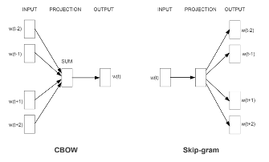

# Methodology

The use of word embeddings in social scientific research is relatively recent. @kozlowski2019geometry are the first to use them to analyze the meaning of words in social discourse, producing a cultural analysis of discourse in a major social science journal.  In political science, @rodman2020timely is the first to produce a thorough analysis of the use of diachronic embeddings to study semantic change. @rheault2020word use word embeddings to study political discourse, but their focus in on ideological placement rather than on the use of embeddings for semantics or sematic change. Recent work also provides guidelines to the applied researcher. @rodriguez2021word focus on general guidelines to train embeddings efficiently: algorithms, parameters, pre-trained vs newly trained embeddings, etc. Their focus is on the general machinery of word embeddings rather than on semantic measurement per se. In another methodological paper, @rodriguez2021embedding focus on semantic change across groups in time. Their method, called à la Carte on Text (conText), extends a linear model, through multivariate regression, refitting pre-trained embeddings to local contexts. One objective of this methodological chapter is to present possible approaches to measuring how a word's meaning varies over circumstances; over time or other covariates. Five models in particular will be tested, the first four first presented by @rodman2020timely, the fifth presented in @rodriguez2021embedding: (1) naïve time series, (2) overlapping model (3) aligned model (4) chronologically trained model (5) à la Carte on Text. This chapter does not present any new results, it rather presents in detail methods used to produce embeddings in social science. An overview is presented in this proposal; more technical details will be given in the dissertation.

## Word embeddings

Using word embeddings, each word from a given text is mapped to a large numerical vector. The vector’s dimension is determined by the researcher; usually between 100 and 500 @rodman2020timely. The given vector represents the context in which the word is generally used. The model can be trained by predicting the word with its context, i.e. the other words around it, on a given window; this is the CBOW model. Alternatively, one can predict the context with the word using the skip-gram model. The GloVe method similarly models word and their context. The main difference is that it takes into account explicitly a matrix of co-occurrences. That is, word frequency enters in the modelling. In practice, these methods are similar, it is not entirely clear when and why they perform better, and GloVe is generally the preferred option in social science @rodriguez2021word. Yet, in general, one of the most popular implementations is through the well-known gensim Python library. As a default, gensim uses CBOW. For instance, the two most recent use of word embeddings in political science use gensim [@rodman2020timely,@rheault2020word].

## doc2vec

There exists an extension to word2vec called doc2vec which embeds paragraphs or documents in the same vector space as words. The paragraph or the document can be thought of as an extra word; and items can be compared. Doc2vec is particularly useful to map the ideological position of a politician or a citizen in this vector space. An example of logical result would be that conservative politician’s embedding will represent a point in space closer to words about the economy or a traditional lifestyle, while a liberal or progressive politician will be mapped to a point closer to words about social justice or redistribution.

```{r, echo=FALSE, fig.cap="Continuous Bag of Words and Skip-gram architectures"}

```

## Diachronic embeddings and semantic change

Measuring changing meaning implies that different words embeddings are calculated at different moments in time. In essence, this is what @rodman2020timely does. In her paper, she raises several issues. First, naturally, cut points will be arbitrary. This might or might not make sense. For instance, changing meaning on equality during the twentieth century might be a gradual process, but changing meaning on terror politics might be dramatic around events like September 11, 2011 or October 29, 1929. Arbitrary cut points therefore require careful thinking. Second, language often is polysemic or includes homonymies. For instance, “black” might be political in some contexts, and only about a color in others. Producing valid embeddings must take this into account. Third, and most importantly, there is the issue of non-comparability between models. Models position words in vector space. Distance can be calculated between words or documents. However, when looking at change in meaning over time, distances from words in many models are compared. This can be a problem as words across models are not aligned [@hamilton2016diachronic]. Rodman provides the analogy to factor analysis. When ran on multiple datasets, it is likely that dimensions produced by factor analysis are similar, yet, factor order might change, or loadings might be on scales which are, in the absolute, non-comparable. For these reasons, while measuring changing word meaning over time, the analyst must proceed with caution.

Several methods exist to deal with non-comparability. Rodman identifies four. A naïve model, where the non-comparability problem is ignored, an overlapping time series models where differences are smoothed across time by including some text from the previous period, a chronologically trained where the model is initialized using results from the previous period and aligned time series where naïve models are ran, then aligned using a matrix alignment. Rodman’s work suggests that a chronologically trained model is the best. The dissertation will validate these assumptions on new datasets.

Other methods exist to deal with semantic change. Long Short Term Memory units (LSTMs) on word embeddings corresponding to time-periods [@boukhaled2019modelling]. Contextualized word embeddings like BERT and ELMo can also model diachronic semantic change [@kutuzov2020distributional]. These methods are more complex to implement and yet to be really used in the social sciences. I will say a few words about them but they will not focus centrally in this dissertation. 

## Uncertainty

Measuring uncertainty when using word embeddings is non-trivial. Yet, when social science researcher make inference, they must accompany with uncertainty statements. The methodology section will discussion the question of uncertainty. The focus will be on bootstrapping methods [@rodman2020timely] and bayesian methods  [@han2018conditional;@lauretig2019identification]