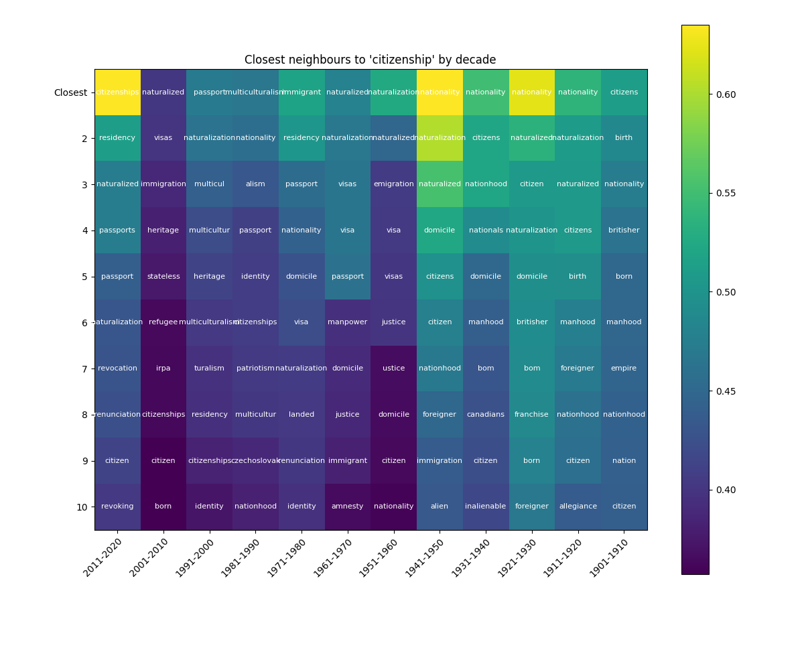

# Capturing the dynamic meanings of political keywords in the Canadian House of Commons

Can we trace the changing meaning of keywords used to talk about politics? Using data from the Canadian Parliamentary debates dataset (Hansard) we model the changing meaning of the words ‘nation’, ‘rights’, ‘citizenship’ and ‘identity’. This choice of words is only preliminary, the list will likely be expanded. 

@rodman2020timely traces the meaning of the word equality in America between 1855 and 2016. In a first step, she uses embeddings to document the underlying structure of equality by asking: equality of what? With word embeddings, she shows how equality is discussed alongside race, gender, international relations and German affairs (for news related to World War II). We will provide a similar analysis for ‘nation’, ‘rights’, ‘citizenship’ and ‘identity’, in the Canadian context.

A working hypothesis is that prior to 1982 discussions of rights were less formal and more abstract, while after 1982, they were grounded in concrete examples. Similarly, debates on identity at the beginning of the twentieth century would have been centered on language, bilingualism or biculturalism, and only in recent years have moded to issues, of sex and gender, sexual minorities, race and multiculturalism. Recent work (Rheault and Cochrane, 2020) has shown that word embeddings and party embeddings can capture a latent concept like ideology. The chapter tests whether it is possible to measure the evolving meaning of concepts central in the history of Canadian politics. Two examples can help illustrate. 

```{r, echo=FALSE, out.width = "100%", fig.cap="Co-sine similarity to 'nation' by decade"}

```

We use model data  from the Hansard dataset to calculate a set of embeddings for each decade during the period 1901-2020. The model use is the default gensim implementation of CBOW with dimensions 300, window 6, using 15 iterations. This is equivalent to Rodman’s “naïve model”. Even with this simple specification, interesting results stand out. Figure 2 shows that during the first decade of the twentieth century, the closest words to ‘nation’ using co-sine similarity were ‘nations’, ‘empire’, ‘republic’, ‘nationhood’ and ‘civilization’. By contrast during the most recent decade, the closest words to ‘nation’ were ‘nations’, ‘country’, ‘cree’, ‘dene’ and ‘snuneymuxw’. During this most recent decade, six out of the 10 closest words to ‘nation’ were Indigenous nations. It is the first decade that at least one Indigenous related word appears. As we can see, words such as ‘empire’, ‘struggle’, ‘conquest’ or ‘survival’ are semantically close to ‘nation’ in early decades, but not in recent decades. 

```{r, echo=FALSE, out.width = "100%",fig.cap="Co-sine similarity to 'citizenship' by decade"}

```

Figure 3 shows results that parallel those just discussed. Using the same word embeddings model, we visualize the closest neighbours to ‘citizenship’ by decade. During the first decade of the twentieth century, omitting the obvious ‘citizens’ the closest words by semantic proximity are ‘birth’, ‘nationality’, ‘britisher’, ‘born’, ‘manhood’, and ‘empire’. In the most recent decade, the closest words are ‘residency’, ‘naturalized’, ‘passports’, ‘passport’, and ‘naturalization’. It seems obvious that a slight shift of meaning for the term ‘citizenship’ has occurred, from an emphasis on ‘birth’ and ‘britishness’, and even ‘maleness’. Mapping these changes, and when exactly they occurred historically, is one objective of this chapter.   
